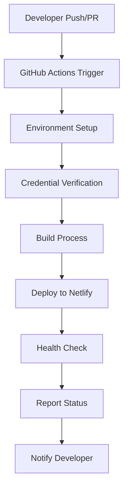
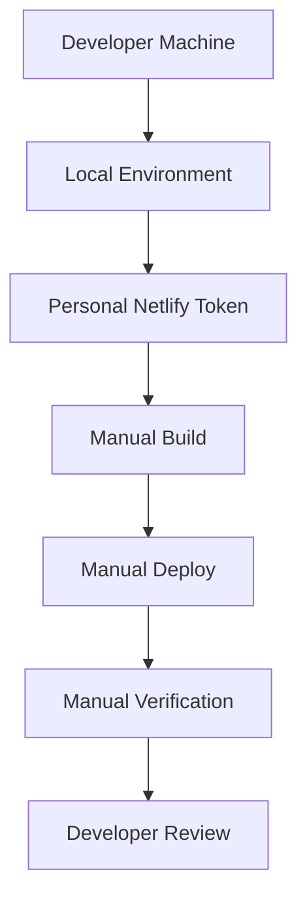

# Deployment Workflows: CI vs Local Development

This document explains the differences between our CI/CD deployment workflow and local development deployment, helping developers understand when and how to use each approach.

## Overview

The Hackerspace Mumbai website uses two distinct deployment workflows:

1. **CI/CD Workflow (GitHub Actions)**: Automated, production-ready deployments
2. **Local Development Workflow**: Manual, developer-controlled deployments

Both workflows deploy to Netlify but use different approaches, commands, and authentication methods.

## CI/CD Workflow (GitHub Actions)

### When It Runs

- **Pull Request Creation/Updates**: Automatically deploys preview builds
- **Main Branch Push**: Automatically deploys to production
- **Manual Trigger**: Can be manually triggered from GitHub Actions tab

### Architecture



### Key Characteristics

#### Authentication
- Uses **GitHub repository secrets**
- `NETLIFY_AUTH_TOKEN`: Stored as encrypted secret
- `NETLIFY_SITE_ID`: Stored as encrypted secret
- **Non-interactive**: No prompts or browser authentication

#### Commands Used
```bash
# Preview deployment (for PRs)
pnpm deploy:preview:ci

# Production deployment (for main branch)
pnpm deploy:prod:ci

# Equivalent to:
netlify deploy --site=$NETLIFY_SITE_ID --dir=dist --functions=netlify/functions --json
```

#### Output Format
- **Structured JSON output** for parsing by automation
- **GitHub Actions annotations** for errors and warnings
- **Deployment URLs** extracted programmatically
- **Status reporting** integrated with GitHub UI

#### Error Handling
- **Comprehensive validation** of credentials before deployment
- **Retry logic** for network failures
- **Sanitized logging** (no credential exposure)
- **Actionable error messages** with GitHub annotations

#### Workflow Steps
```yaml
# Simplified GitHub Actions workflow
steps:
  - name: Checkout code
  - name: Setup Node.js and pnpm
  - name: Install dependencies
  - name: Verify Netlify credentials
    run: |
      if [ -z "$NETLIFY_AUTH_TOKEN" ]; then
        echo "::error::NETLIFY_AUTH_TOKEN is not set"
        exit 1
      fi
      netlify status --json
  - name: Build site
  - name: Deploy to Netlify
    run: pnpm deploy:preview:ci
  - name: Post-deployment health check
  - name: Report deployment URL
```

### Advantages

- **Fully automated**: No manual intervention required
- **Consistent environment**: Clean, reproducible builds
- **Integrated testing**: Runs tests before deployment
- **Security**: Credentials managed securely
- **Visibility**: Status visible in GitHub UI
- **Rollback capability**: Easy to revert problematic deployments

### Limitations

- **No real-time debugging**: Can't interact during deployment
- **Fixed configuration**: Less flexibility for experimentation
- **Dependency on GitHub**: Requires GitHub Actions to be available
- **Slower feedback**: Takes time to queue and run

## Local Development Workflow

### When to Use

- **Testing changes** before creating a pull request
- **Debugging deployment issues** with real-time feedback
- **Rapid iteration** on deployment-related changes
- **Emergency deployments** when CI/CD is unavailable
- **Experimentation** with deployment configurations

### Architecture



### Key Characteristics

#### Authentication
- Uses **personal Netlify access tokens**
- Stored in **local environment variables** or `.env` file
- **Interactive fallback**: Can prompt for login if needed
- **Personal scope**: Tied to individual developer account

#### Commands Used
```bash
# Preview deployment
pnpm deploy:preview

# Production deployment (use with caution)
pnpm deploy:prod

# Equivalent to:
netlify deploy --site=$NETLIFY_SITE_ID --dir=dist --functions=netlify/functions
```

#### Output Format
- **Human-readable output** with colors and formatting
- **Interactive prompts** when needed
- **Direct URL display** for immediate access
- **Verbose logging** for debugging

#### Error Handling
- **Interactive debugging**: Can respond to prompts
- **Immediate feedback**: Errors shown in real-time
- **Manual retry**: Developer controls retry attempts
- **Detailed logging**: Full error context available

#### Typical Workflow
```bash
# 1. Set up environment
export NETLIFY_AUTH_TOKEN="your_token"
export NETLIFY_SITE_ID="your_site_id"

# 2. Verify authentication
netlify status

# 3. Build locally
pnpm build

# 4. Deploy preview
pnpm deploy:preview

# 5. Test the preview URL
# 6. Make adjustments if needed
# 7. Repeat as necessary
```

### Advantages

- **Fast feedback**: Immediate results and debugging
- **Interactive**: Can respond to prompts and errors
- **Flexible**: Easy to modify commands and parameters
- **Full control**: Developer manages entire process
- **Debugging friendly**: Can inspect and modify at each step

### Limitations

- **Manual process**: Requires developer intervention
- **Environment dependent**: Results may vary by machine
- **Security risk**: Credentials stored locally
- **No automatic testing**: Must manually run tests
- **Inconsistent**: Different developers may have different setups

## Comparison Matrix

| Aspect | CI/CD Workflow | Local Development |
|--------|----------------|-------------------|
| **Trigger** | Automatic (git events) | Manual (developer command) |
| **Authentication** | Repository secrets | Personal tokens |
| **Environment** | Clean, isolated | Developer machine |
| **Output** | JSON, structured | Human-readable |
| **Interaction** | Non-interactive | Interactive |
| **Speed** | Slower (queue time) | Faster (immediate) |
| **Consistency** | High | Variable |
| **Debugging** | Limited | Full access |
| **Security** | High | Medium |
| **Testing** | Automated | Manual |
| **Rollback** | Easy | Manual |

## Command Reference

### CI/CD Commands (used by GitHub Actions)

```bash
# These commands are used automatically by CI/CD
# You typically don't run these locally

# Preview with JSON output
pnpm deploy:preview:ci
# Equivalent to:
netlify deploy --site=$NETLIFY_SITE_ID --dir=dist --functions=netlify/functions --json

# Production with JSON output
pnpm deploy:prod:ci
# Equivalent to:
netlify deploy --prod --site=$NETLIFY_SITE_ID --dir=dist --functions=netlify/functions --json

# Credential verification
netlify status --json
```

### Local Development Commands

```bash
# These commands are for local development use

# Preview deployment
pnpm deploy:preview
# Equivalent to:
netlify deploy --site=$NETLIFY_SITE_ID --dir=dist --functions=netlify/functions

# Production deployment (be careful!)
pnpm deploy:prod
# Equivalent to:
netlify deploy --prod --site=$NETLIFY_SITE_ID --dir=dist --functions=netlify/functions

# Authentication check
netlify status

# Interactive login (if needed)
netlify login

# List available sites
netlify sites:list
```

## Best Practices

### For CI/CD Workflow

1. **Monitor deployments**: Watch GitHub Actions for failures
2. **Review preview URLs**: Check preview deployments before merging
3. **Keep secrets updated**: Rotate tokens regularly
4. **Test locally first**: Use local workflow before pushing
5. **Document changes**: Update workflow when modifying deployment process

### For Local Development Workflow

1. **Secure credentials**: Use environment variables, not hardcoded tokens
2. **Test before production**: Always use preview deployments first
3. **Verify authentication**: Check `netlify status` before deploying
4. **Clean builds**: Run `pnpm build` before each deployment
5. **Document experiments**: Note any configuration changes made

### Security Considerations

#### CI/CD Security
- Repository secrets are encrypted and only available to authorized workflows
- Secrets are not exposed in logs or output
- Access is controlled by GitHub repository permissions
- Audit trail available through GitHub Actions logs

#### Local Development Security
- Personal tokens should be stored securely (environment variables)
- Never commit tokens to version control
- Use `.env` files and add them to `.gitignore`
- Rotate personal tokens regularly
- Limit token scope to minimum required permissions

## Troubleshooting

### CI/CD Issues

**Deployment fails in GitHub Actions:**
1. Check GitHub Actions logs for specific error
2. Verify repository secrets are set correctly
3. Test the same deployment locally
4. Check Netlify service status

**Secrets not working:**
1. Verify secret names match workflow file exactly
2. Check secret values don't have extra spaces
3. Ensure secrets are set at repository level, not organization
4. Re-create secrets if they seem corrupted

### Local Development Issues

**Authentication fails:**
```bash
# Check if token is set
echo $NETLIFY_AUTH_TOKEN

# Test authentication
netlify status

# Re-authenticate if needed
netlify login
```

**Site not found:**
```bash
# Verify site ID
echo $NETLIFY_SITE_ID

# List available sites
netlify sites:list

# Check site access
netlify api getSite --data='{"site_id":"YOUR_SITE_ID"}'
```

## Migration Guide

### From Interactive to Token-Based Authentication

If you're currently using `netlify login` for local development:

1. **Generate a personal access token**:
   - Go to Netlify User Settings > Applications
   - Create new access token
   - Copy the token

2. **Update your local environment**:
   ```bash
   # Add to .env file
   echo "NETLIFY_AUTH_TOKEN=your_token_here" >> .env
   echo "NETLIFY_SITE_ID=your_site_id_here" >> .env
   
   # Or export directly
   export NETLIFY_AUTH_TOKEN="your_token_here"
   export NETLIFY_SITE_ID="your_site_id_here"
   ```

3. **Test the new authentication**:
   ```bash
   netlify status
   pnpm deploy:preview
   ```

4. **Update your shell profile** for persistence:
   ```bash
   echo 'export NETLIFY_AUTH_TOKEN="your_token_here"' >> ~/.bashrc
   echo 'export NETLIFY_SITE_ID="your_site_id_here"' >> ~/.bashrc
   ```

### From Old to New Deployment Commands

If you're using old deployment commands:

**Old commands:**
```bash
netlify deploy
netlify deploy --prod
```

**New commands:**
```bash
pnpm deploy:preview
pnpm deploy:prod
```

**Benefits of new commands:**
- Explicit site ID specification
- Consistent build directory and functions path
- Better error handling
- Alignment with CI/CD workflow

## Monitoring and Observability

### CI/CD Monitoring

- **GitHub Actions dashboard**: View deployment status and logs
- **Netlify dashboard**: Monitor site deployments and performance
- **GitHub commit status**: See deployment status on commits and PRs
- **Notifications**: Configure GitHub notifications for deployment failures

### Local Development Monitoring

- **Terminal output**: Real-time deployment progress and errors
- **Netlify CLI logs**: Detailed information about deployment process
- **Browser testing**: Direct verification of deployed changes
- **Network inspection**: Debug API calls and asset loading

## Future Improvements

### Planned Enhancements

1. **Enhanced error reporting**: Better error messages and recovery suggestions
2. **Deployment metrics**: Track deployment success rates and performance
3. **Automated rollback**: Automatic rollback on health check failures
4. **Multi-environment support**: Staging and development environment deployments
5. **Integration testing**: Automated testing of deployed applications

### Contributing to Deployment Workflows

If you want to improve our deployment processes:

1. **Test changes locally** using the local development workflow
2. **Create feature branch** for deployment-related changes
3. **Update documentation** when modifying workflows
4. **Test in CI/CD** by creating a pull request
5. **Monitor deployment** after changes are merged

This ensures that improvements to our deployment workflows are thoroughly tested and documented.