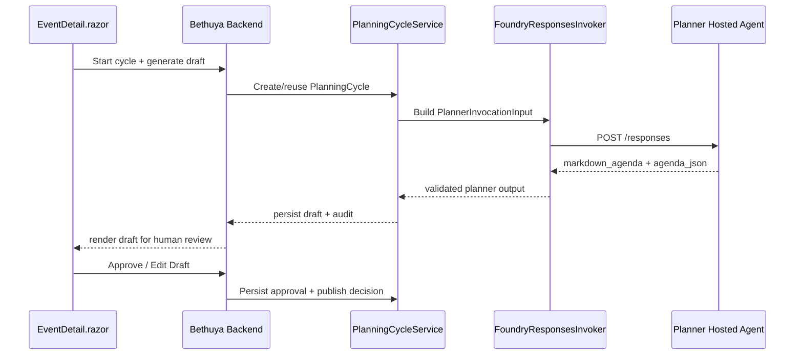
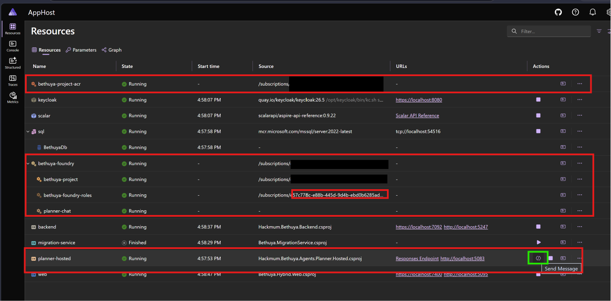
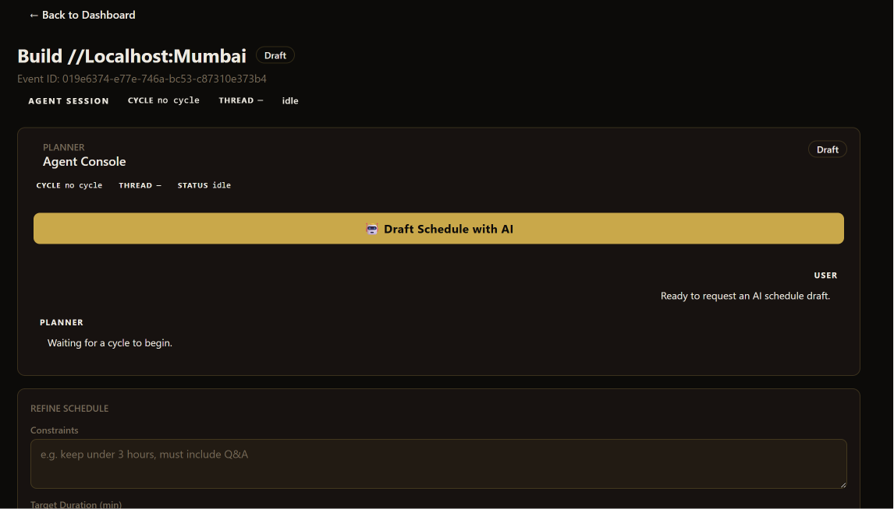
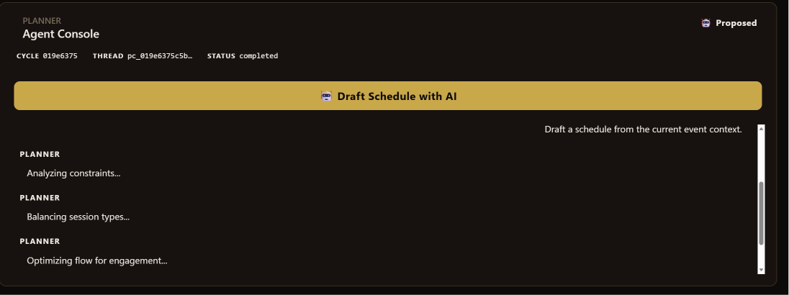
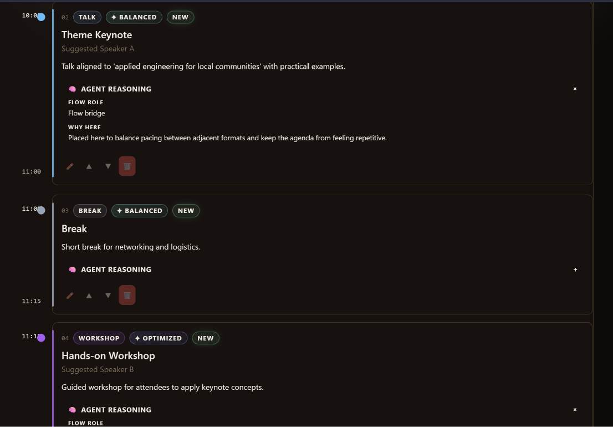
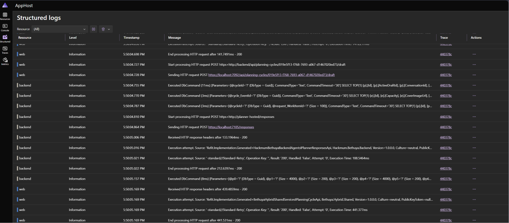
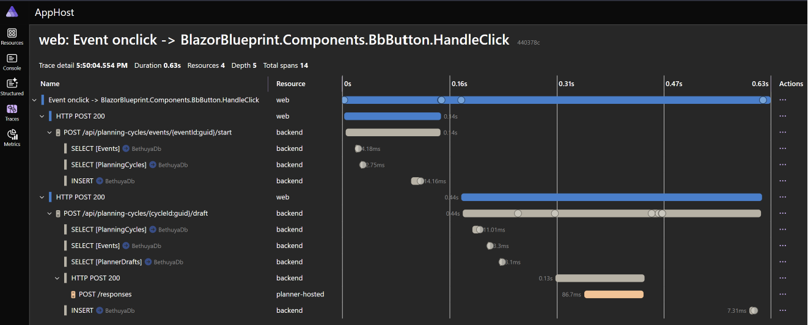

import { Image } from 'astro:assets';


Most agent demos look impressive until you try putting them into production. Suddenly you’re drowning in containerization, auth, observability, versioning, and governance headaches.


At HackerspaceMumbai, we wanted something different for Bethuya which is our  **agent-first**, **Aspire-orchestrated** platform for planning, curating, running, and reporting community events - built with a simple principle: **AI drafts, humans approve, community owns**.  
It’s demo-ready today and designed to become the backbone of our event ops tomorrow.

In this post, we’ll share how we’re evolving Bethuya into a **production-grade showcase** for the “new era” of agentic AI - starting by deploying the **Planner** as a **Microsoft Foundry Agent Service Hosted Agent**, while keeping Bethuya as the **central orchestrator**.

---

## Why “Hosted Agents” (and not just “calling an LLM”)?

When you move agents past the prototype phase, 90% of the engineering isn't prompt tuning - it's **distributed systems plumbing**:
*   **Infrastructure:** Containerization, web server scaffolding, and lifecycle management.
*   **Security & Identity:** Managing API keys, token propagation, and secure boundaries.
*   **State & Resilience:** Scaling, memory/file persistence, and zero-downtime rollouts.
*   **Observability:** Distributed tracing across agent execution loops.

**[Foundry Hosted Agents](https://learn.microsoft.com/en-us/azure/ai-services/azure-ai-foundry/overview-hosted-agents)** solve these cross-cutting concerns by providing a managed runtime. You bring your agent code (C#, Python, or your framework of choice), package it as a container image, and the platform handles the execution, lifecycle, and instrumentation at scale.

---

## Aspire vs Hosted Agents: A clean separation of concerns

We are using both because they solve entirely different layers of the cloud-native agent stack:

### 🎛️ Aspire = the cockpit (composition + provisioning + local loop)
Aspire gives us a single, consistent way to define, compose, provision, and run our entire distributed application: both locally, and in the cloud.

### 🧠 Hosted Agents = the runtime (agent ops + lifecycle)
Hosted Agents turn an agent into a first-class deployable unit with its own endpoint, identity, scaling, sessions, and versioning.

| Dimension | App Host: Aspire | Runtime: Foundry Hosted Agents |
| :--- | :--- | :--- |
| **The Role** | **The Cockpit** (Composition & Provisioning) | **The Brain** (Agent Execution & Lifecycle) |
| **Local Loop** | Orchestrates database, Redis, Keycloak, and local agent containers. | Simulates agent endpoints locally for rapid debugging. |
| **Production** | Generates deployment manifests; wires service discovery. | Acts as a isolated, stateful, secure execution unit. |

> Mental model: Aspire defines the **topology of the entire system**. Hosted Agents operate **each individual agent** like an independent, versioned microservice.


---

## Our current architecture: Bethuya as central orchestrator (Option A)

### Option A (Now): Bethuya orchestrates agents

For now, **Bethuya remains the central orchestrator**:

- It calls the Planner (and soon Curator, Facilitator, Reporter)
- It stores audit trails, diffs, human approvals, and published artifacts
- No plan is ever auto-published - human approval is mandatory

This keeps governance clear, debuggable, and trustworthy.


### Option B (Later): agent delegation (A2A)

We are designing the interfaces and audit envelope in such a way that we can later enable **agent delegation** (agent-to-agent), while preserving Bethuya’s governance boundaries.

---

## Planner-first: Why we’re starting here

The Planner is the ideal first Hosted Agent. Its job is well-scoped and naturally “service-like”:

* Draft agendas, timings, speaker suggestions, and session formats
* Never publishes anything without explicit human approval

This makes it low-risk and high-value for our community events workflow.

***

### 🚩 A real-world lesson from Mumbai

There’s also a deeper reason this matters.

Last year, event booking for Microsoft offices in India was centralized. When the team was scheduling **[VS Code Dev Days for Mumbai](https://www.meetup.com/mumbai-technology-meetup/events/310498740/)**, folks sitting at the Microsoft office in Bengaluru picked a date that looked perfect on paper:

* ✅ Venue available
* ✅ Not a public holiday
* ✅ Everything aligned in the booking system

Unfortunately, it landed on the **10th day of Ganpati**.

In Mumbai, that means

* 🚧 City-wide processions
* 🚦 Heavy traffic disruption
* 🎉 Strong cultural focus across the city

👉 Not a day you schedule a developer event.

***

### ✅ What actually happened

The issue was caught, and the event was **rescheduled** to align with Mumbai’s cultural calendar.

This is exactly the kind of **human-in-the-loop correction** Bethuya is designed to enforce.

***

### ⚡ Field Lesson

> A date that is “valid” in a system can still be **completely wrong in the real world**.

```text
APIs ≠ Context
Availability ≠ Suitability
Optimization ≠ Real-world fit
```

***

### 🧠 Why this matters for Bethuya

This is precisely why Bethuya enforces a **hard boundary**:

* The **Planner Agent handles the heavy lifting**  
  (drafting agendas, proposing schedules, optimizing options)

* But it only emits **structured drafts - not decisions**

The final call stays with:

> **local organizers who actually understand their community**

***

### ✅ The outcome: AI that augments, not overrides

With this model:

* AI becomes a **context-aware advisor**
  * can surface conflicts like festivals or local constraints
  * can suggest better alternatives

* Humans remain the **decision-makers**
  * applying lived, cultural, and situational knowledge

***

💡 **In short:**

> The Planner is our first step toward building AI systems that are not just intelligent   
> but *situationally aware and locally grounded*.

---

## The subtle production detail: Conversations ≠ Sessions

During implementation, we hit a critical architectural nuance within the Foundry Hosted Agents runtime. **Sessions** and **conversations** are fundamentally decoupled concepts:

*   **A Session** = A stateful, isolated container sandbox with a persisted filesystem (`$HOME`, uploaded media, short-term scratchpads).
*   **A Conversation** = The linear message, tool-call, and turn history that threads an interaction together.

For multi-turn agent execution, continuity relies on tracking the **Conversation ID** or `previous_response_id`. Reusing the same *Session ID* ensures the agent has access to the same files, but **it will completely forget prior chat history** if the conversation context isn't threaded explicitly. 

It is incredibly easy to build an agent that *looks* stateful because it reads from the same disk space, while it is actually suffering from total context amnesia.

To move from concept to implementation, let’s look at how Bethuya actually models and executes a planning workflow.


---

## Architecture Deep Dive: State, Execution, and Agent Boundaries

The key architectural choice in Bethuya is simple:

> **Bethuya orchestrates. The Planner Hosted Agent drafts.**

Everything else - PlanningCycles, conversation IDs, hybrid outputs - flows from this boundary.

---

## 🧠 Part 1: State Model - One Conversation per Planning Cycle

Instead of maintaining a “forever thread” for an event, Bethuya introduces a first-class domain object: the `PlanningCycle`.

Why? Because in a production community app, three things evolve rapidly:

- **Schemas** → structured JSON payloads change  
- **System Prompts** → agent behavior shifts over time  
- **Orchestration Boundaries** → tasks move between services and agents  

Mixing old assumptions with new schemas in a single thread makes debugging, traceability, and reproducibility extremely difficult.

### Lifecycle of a PlanningCycle

- **Open**  
  A cycle is created when drafting begins. All interactions share a **conversationId**, which acts as the durable thread for that planning window.

- **Lock on Publish**  
  When the organizer publishes the schedule, the cycle is permanently sealed.

- **Revisions**  
  Any further updates create a **new PlanningCycle** with a fresh conversationId, referencing the previous version.

👉 This gives us clean provenance:  
we always know which **agent version, prompt set, and conversation** produced a published schedule.

---

## ⚙️ Part 2: Execution Flow - How a Planner Request Actually Runs

The PlanningCycle defines *state*.  
Now let’s look at *execution*.

When an organizer clicks **Draft Schedule with AI**:

1. Bethuya creates or reuses a `PlanningCycle`  
2. The cycle provides a **conversationId (scoped context for this planning window)**  
3. Bethuya constructs a `PlannerInvocationInput` from event data  
4. It calls the Planner Hosted Agent via its `/responses` endpoint  
5. The agent returns a draft  
6. Bethuya validates, persists, and surfaces it for human review  

👉 At runtime, the orchestration boundary becomes explicit:



---

## 📦 Part 3: Hybrid Output - Designed for Humans and Machines

The Planner Agent yields a dual-headed response payload:

1.  **Markdown Agenda:** Human-readable, and perfectly optimized for Git-style diffs in our front-end.
2.  **JSON Sidecar:** Machine-readable data structures used for backend workflows, validation, and future Agent-to-Agent (A2A) delegation.

JSON is the source of truth; Markdown is the rendering.

```json
{
  "eventMetadata": { "title": "...", "timezone": "Asia/Kolkata" },
  "agendaBlocks": [
    { "start": "10:00", "end": "11:00", "format": "Workshop" }
  ],
  "governance": { "rationale": "...", "identifiedRisks": [] }
}
```
This makes the UI great today and keeps us ready for deeper automation tomorrow.

---

## 🧩 Part 4: System Boundary - Governance vs Reasoning
This architecture enforces a strict separation of concerns:

* **Bethuya**
  * System of record
  * Owns workflows, approvals, publishing, and lifecycle
  * Maintains audit trails and provenance

* **Planner Hosted Agent**
  * Stateless (or session-scoped) reasoning runtime
  * Generates structured drafts
  * Has no authority to publish or mutate application state

This boundary is deliberate.

It ensures that:

* AI systems remain **assistive**
* Business rules remain **deterministic**
* Governance remains **human-controlled**

***

## ✅ The Outcome: Production-Grade Agentic Systems

This separation gives us the best of both worlds:

* Agents can evolve independently  
  (better prompts, improved reasoning, richer outputs)

* The application retains control  
  (governance, lifecycle, auditability)

***

💡 **In short:**

> The agent optimizes.  
> The application decides.

---

## 🚀 Aspire + Foundry Integration: From Code to Running Agents in Minutes

Up to this point, we’ve focused on architecture.

But one of the biggest surprises while building Bethuya was this:

> **How little effort it actually took to get a Hosted Agent running locally and in Azure.**

---

### 🧑‍💻 The setup experience

Once you’re authenticated (`az login`), the flow is almost frictionless.

Using Aspire’s Azure AI Foundry integration:

- You select or create:
  - an Azure subscription  
  - a resource group  
  - a Foundry project  

From there, Aspire handles the rest:
- provisioning resources  
- wiring dependencies  
- configuring endpoints  

👉 Canonical reference:  
https://aspire.dev/integrations/cloud/azure/azure-ai-foundry/azure-ai-foundry-host/

---

### 🏗️ What Aspire sets up for you

With minimal setup, Aspire provisions and connects:

- ✅ Azure Container Registry (ACR)  
- ✅ Foundry Project + model deployment  
- ✅ Hosted Agent runtime  
- ✅ Local + cloud configuration parity  
- ✅ Identity and role bindings  

👉 The experience feels like:

> “Run your app locally - and Azure just shows up behind the scenes.”

---

### 🔍 What this looks like in practice

Below is the Aspire AppHost resources view.

The highlighted resources represent the Hosted Agent infrastructure:

- `bethuya-project-acr` → container registry for agent images  
- `bethuya-foundry`, `bethuya-project` → Foundry wiring  
- `planner-chat` → model deployment  
- `planner-hosted` → running Hosted Agent  

 

---

### 🟢 Agent-aware UI: “Send Message” capability

Notice the small icon next to `planner-hosted`.

This icon appears only for **agent-capable endpoints** - specifically those exposing a `/responses` interface.

Clicking it allows you to:

- Send prompts directly to the agent  
- Inspect responses interactively  
- Validate behavior without going through the app  

👉 This is a subtle but powerful signal:

> Aspire recognizes this as an **interactive AI endpoint**, not just a backend service.

---

💡 **In short:**

> If you can "Send Message" to a service, it’s not just a service - it’s an agent.

---
## 🧠 The Planner in Action: From Intent to Reasoned Output

At this point, it’s worth looking at what the Planner actually feels like in the UI.

---

### 🖱️ Step 1: Initiating the draft

The interaction begins with a single action in the Agent Console:

> **Draft Schedule with AI**



At this stage:

- No PlanningCycle exists yet  
- The agent is idle  
- The system is ready to initiate a new conversation  

### 🔁 Step 2: The agent starts reasoning

Once triggered, the Planner doesn’t immediately return a result.
Instead, it surfaces intermediate reasoning steps:



“Analyzing constraints…”
“Balancing session types…”
“Optimizing flow for engagement…”

👉 This is intentional.
The goal is to make the agent’s process visible and legible, rather than a black box.

### 🧩 Step 3: Structured schedule + reasoning

The final output is not just a schedule - it is a reasoned timeline.


Each agenda block includes:

* Structured metadata:
  * type (`talk`, `workshop`, `break`)
  * optimization tags (`balanced`, `optimized`, `new`)

* And critically:
  * **Agent reasoning**

Example:

> *“Placed here to balance pacing between adjacent formats and keep the agenda from feeling repetitive.”*

***

### 🧠 Why this matters

Most scheduling tools generate a timeline.

The Planner does something more:

* It **constructs** the schedule
* It **explains** its decisions
* It allows those decisions to be **reviewed and challenged**

***

💡 **In short:**

> The output is not just a schedule -  
> it is a **defensible plan**.
---

### 🔁 What happens behind the scenes

From this single interaction:

- A `PlanningCycle` is created or reused  
- A `conversationId` scopes the context  
- Bethuya constructs the Planner request  
- The Hosted Agent is invoked via `/responses`  
- A hybrid draft is generated  
- The result is persisted and rendered  

---

💡 **One button. One conversation. One bounded agent interaction.**

---

## 🔎 Observing the Agent in Action

One of the strongest aspects of this setup is **observability**.

---

### 📜 Structured logs: Verifying the agent call

In Aspire’s Structured Logs view, we can see the exact invocation:

- `Start processing HTTP request POST /responses`  
- `Sending HTTP request http://planner-hosted/responses`  
- `Received HTTP response 200`  



👉 This confirms:
- The agent is invoked via `/responses`
- The request/response cycle is successful
- The interaction is visible at the HTTP layer

---

### 🔁 Distributed traces: End-to-end execution flow

The Traces view provides a complete picture:

- UI interaction (`Event onclick`)
- Backend orchestration
- Database access
- Agent invocation (`POST /responses`)
- Response propagation



---

### 🧠 What’s important here

- The agent appears as a **distinct span (`planner-hosted`)**
- You can see exactly where time is spent  
- The boundary between:
  - application logic  
  - agent reasoning is explicit  

---

💡 **This is critical:**

> You’re not guessing what the agent did.  
> You can see exactly when, where, and how it was invoked.

---

## 🧩 Bringing it all together

These views form a complete, observable pipeline:

- UI → where the interaction begins  
- Logs → proof of the `/responses` call  
- Traces → end-to-end orchestration flow  

---

💡 **In short:**

> With Aspire, agents are not just deployed -  
> they are observable, testable, and interactive from day one.

---

## What Real production-grade "Agent Ops" Looks Like

### 🚀 Independent Shipability
We can tune, iterate, and deploy the Planner's container image without touching or redeploying the core web app.

### 🧠 Brain Versioning
We can pinpoint exactly which version of the prompt/model generated a specific line-item artifact.


### 📊 Built-in End-to-End Observability
We trace requests seamlessly from the Blazor UI -> Hosted Agent container -> LLM token completion, and we can correlate everything to a PlanningCycle/work item.

### 🛡️ Human-First Governance
The system remains deterministic. AI proposes; humans control the state transition.


---

## Getting involved


We’re building all of this in the open and would love your help.

- **Code contributions**: [Bethuya repository](https://github.com/HackerspaceMumbai/bethuya)
- **Blog / documentation**: [HackerspaceMumbai/blog](https://github.com/HackerspaceMumbai/blog)

Whether you want to work on the Planner agent, improve orchestration, add new agents, or just hang out and brainstorm - you and your PRs are welcome.

Let’s build the future of community events, one thoughtful agent at a time.


