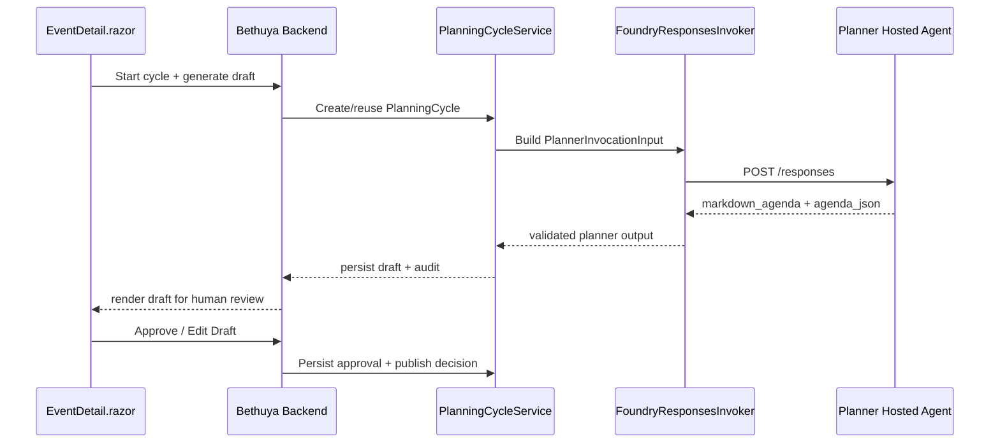

import { Image } from 'astro:assets';import AspireResourcesView from './aspire_resources_view.png';
import AgentBefore from './agent_before.png';
import AgentThinking from './agent_thinking.png';
import AgentOutput from './agent_output.png';
import BethuyaAspireLogs from './bethuya_aspire_logs.png';
import BethuyaAspireTraces from './bethuya_aspire_traces.png';

Most agent demos look impressive until you try to put them into production. Suddenly you’re dealing with containerization, auth, observability, versioning, and governance.


At HackerspaceMumbai, we wanted something different.

**Bethuya** is our  **agent-first**, **Aspire-orchestrated** platform for planning, curating, running, and reporting community events - built on a simple principle: 

> **AI drafts, humans approve, community owns**.  

It’s demo-ready today and designed to become the backbone of our event operations.

In this post, we show how we’re evolving Bethuya into a **production-grade agentic system** - starting by deploying the Planner as a **Microsoft Foundry Hosted Agent (right now in public preview)**, while keeping Bethuya as the central orchestrator.

---

## Why Hosted Agents (and not just calling an LLM)?

Once you move beyond prototypes, most of the work isn’t prompt engineering-it’s systems engineering.

* **Infrastructure** - containerization, service hosting, lifecycle management
* **Security & Identity** - token flow, isolation boundaries, secure access
* **State & Resilience** - scaling, persistence, rollout safety
* **Observability** - tracing across distributed execution

**[Foundry Hosted Agents](https://learn.microsoft.com/en-us/azure/ai-services/azure-ai-foundry/overview-hosted-agents)** handle these cross-cutting concerns.

You bring your agent code (C#, Python, or otherwise).  
The platform handles execution, lifecycle, identity, and instrumentation.

---

## Aspire vs Hosted Agents: A clean separation of concerns

We are using both because they solve entirely different layers of the cloud-native agent stack:

### 🎛️ Aspire = the cockpit

Defines, composes, and runs the entire distributed system-locally and in Azure.

### 🧠 Hosted Agents = the runtime

Turn an agent into a **first-class execution unit** with its own endpoint, identity, and lifecycle.

| Dimension  | Aspire                   | Hosted Agents             |
| ---------- | ------------------------ | ------------------------- |
| Role       | System composition       | Agent execution           |
| Local      | Runs full app topology   | Simulates agent endpoints |
| Production | Generates infra + wiring | Hosts agent runtime       |

> Aspire defines the topology. Hosted Agents execute the brains.

---

## Architecture: Bethuya as the orchestrator

### Option A (current): centralized orchestration

Bethuya is the system of record:

* Calls Planner (and future agents: Curator, Facilitator, Reporter)
* Stores drafts, approvals, and published artifacts
* Enforces human approval before publishing

This keeps the system **governable and debuggable**.

### Option B (future): agent-to-agent (A2A)

We are designing for future delegation:

> *(A2A = one agent invoking another as part of a workflow)*

The goal is to enable distributed intelligence without losing auditability.

---

## Planner-first: Why we’re starting here

The Planner is the ideal first Hosted Agent. Its job is well-scoped and naturally “service-like”:

* Draft agendas, timings, speaker suggestions, and session formats
* Never publishes anything without explicit human approval
* Produces structured, reviewable output

This makes it low-risk and high-value for our community events workflow.

***

### 🚩 A real-world lesson from Mumbai

Last year, event booking for Microsoft offices in India was centralized. 

When scheduling **[VS Code Dev Days for Mumbai](https://www.meetup.com/mumbai-technology-meetup/events/310498740/)**, a date was chosen that looked perfect:

* ✅ Venue available
* ✅ Not a public holiday
* ✅ Calendar booking system aligned

Unfortunately, it landed on the **10th day of Ganpati**.

In Mumbai, that means:

* 🚧 City-wide processions
* 🚦 Heavy traffic disruption
* 🎉 Strong cultural focus across the city

👉 Not a day you schedule a developer event.

***

### ✅ What actually happened

The issue was caught, and the event was **rescheduled**.

This is exactly the kind of **human-in-the-loop correction** Bethuya is designed for.

***

### ⚡ Field Lesson

> A date that is “valid” in a system can still be **completely wrong in the real world**.

```text
APIs ≠ Context
Availability ≠ Suitability
Optimization ≠ Real-world fit
```

***

### 🧠 Why this matters

Bethuya enforces a strict boundary:

* The agent **proposes**
* Humans **decide**

The system optimizes-but does not override local knowledge.

***

---

## Conversations ≠ Sessions

A critical nuance in Foundry:

* **Session** → container runtime (filesystem, compute context)
* **Conversation** → message/thread history

Continuity depends on **conversation threading**  
(e.g., `previous_response_id` in the Responses API)

A system can look stateful-while silently forgetting everything.

---

## Architecture Deep Dive: State, Execution, and Agent Boundaries


> **Bethuya orchestrates. Planner(Hosted Agent) drafts.**

Everything else - PlanningCycles, conversation IDs, hybrid outputs - flows from this boundary.

---

## 🧠 State Model - Planning Cycle

Instead of a “forever thread,” we use a **PlanningCycle**.

Why?

Because these evolve:

* Schemas
* Prompts
* Orchestration boundaries


***

#### Lifecycle

* **Open** → cycle starts, conversationId assigned
* **Lock** → publish seals the cycle
* **Revise** → new cycle, new conversation

👉 Ensures full provenance of every schedule

---

## ⚙️ Execution Flow

* Bethuya creates/reuses a PlanningCycle
* Assigns a conversationId
* Builds request payload
* Calls Planner via `/responses`

This endpoint follows the **[OpenAI Responses API contract](https://platform.openai.com/docs/api-reference/responses)**, implemented by Foundry Hosted Agents:


* Agent returns structured output
* Bethuya validates, persists, and renders

👉 At runtime, the orchestration boundary becomes explicit:



---

## 📦 Hybrid Output

The Planner returns:

* **Markdown** → human-readable
* **JSON** → machine-verifiable

JSON is the source of truth. Markdown is the UI.

```json
{
  "AgendaVersion": "1.0",
  "Event": {
    "EventId": "019e63e8-f999-7978-88a0-33d97758df3c",
    "Title": "Build //Localhost : Mumbai",
    "Date": "2026-06-20",
    "Timezone": "Asia/Kolkata",
    "Location": "Microsoft Mumbai"
  },
  "Objectives": [
    "Maximize attendance fit with venue/locality constraints.",
    "Balance learning content with networking windows.",
    "Provide explicit ownership for next actions."
  ],
  "Constraints": [],
  "Agenda": {
    "TotalDurationMinutes": 195,
    "Blocks": [
      {
        "BlockId": "blk-01",
        "Start": "09:30",
        "End": "10:00",
```

---

## 🧩 System Boundary 

**Bethuya**

* System of record
* Owns workflows, approvals, publishing

**Planner Agent**

* Session-scoped reasoning runtime
* Generates proposals
* Cannot mutate application state

***

> 💡 **The agent optimizes. The application decides.**

It ensures that:

* AI systems remain **assistive**
* Business rules remain **deterministic**
* Governance remains **human-controlled**

***


---

## 🚀 Aspire + Foundry Integration

-The biggest surprise building Bethuya:

> How easy it was to go from code to a running agent.

---

### 🧑‍💻 The setup experience

Once you’re authenticated (`az login`), the flow is almost frictionless.

Using [Aspire’s Azure AI Foundry integration](https://aspire.dev/integrations/cloud/azure/azure-ai-foundry), you can go from zero to a running Hosted Agent in minutes.

- You select or create:
  - an Azure subscription  
  - a resource group  
  - a Foundry project  

From there, Aspire handles the rest:
* resource provisioning
* environment wiring
* endpoint configuration

---

### 🏗️ What gets created

With minimal setup, Aspire provisions and connects:

- ✅ Azure Container Registry (ACR)  
- ✅ Foundry Project + model deployment  
- ✅ Hosted Agent runtime  
- ✅ Local + cloud configuration parity  
- ✅ Identity and role bindings  

> Run locally-and Azure appears behind the scenes.


<Image src={AspireResourcesView} alt="Aspire Resources View" />

---

### 🟢 Agent-aware UI

Aspire surfaces agents differently.

The “Send Message” icon [highlighted in green box] appears **only for agent endpoints (`/responses`)**.

* Send prompts directly
* Inspect responses
* Debug in isolation

> If you can message it, it’s an agent.

---

## 🧠 The Planner in Action: From Intent to Reasoned Output


The Planner shows:

* Initial state → idle
* Thinking → reasoning steps
* Output → structured timeline + explanation

<Image src={AgentBefore} alt="Agent Before" />

<Image src={AgentThinking} alt="Agent reasoning logs" />

<Image src={AgentOutput} alt="Agent Output" />


Each block includes:

* Type (Talk, Workshop, Break)
* Optimization tags
* Explicit reasoning (“why here”)

> The Planner doesn’t just generate a schedule-it shows its work.


## 🔎 Observing the Agent in Action

One of the strongest aspects of this setup is **observability**.

---

### 📜 Structured logs


* `POST /responses`
* Request → response cycle
* Status = 200

<Image src={BethuyaAspireLogs} alt="Structured Logs" />

---

### 🔁 Distributed traces

End-to-end:

UI → Backend → Agent → Response

* Agent appears as its own span
* Boundaries are explicit
* Timing is visible


<Image src={BethuyaAspireTraces} alt="Trace Timeline" />


> 💡 You don’t guess what happened-you **see it**. 

---

## 🧩 Bringing it all together

* UI → entry point
* Logs → invocation
* Traces → orchestration  

> 💡 **Agents are not just deployed-they are observable, testable, and governable.**

---

## What production-grade Agent Ops looks like

### 🚀 Independent deployment

Agents evolve independently of the app

### 🧠 Brain versioning

Every output tied to agent + prompt version

### 📊 Observability

Trace across UI → agent → model


### 🛡️ Human-First Governance
AI proposes. Humans own state transitions.

---

## Getting involved


We’re building Bethuya in the open.

- **Code contributions**: [Bethuya repository](https://github.com/HackerspaceMumbai/bethuya)
- **Blog / documentation**: [HackerspaceMumbai/blog](https://github.com/HackerspaceMumbai/blog)

Come build with us.

> 💡 **Let’s design systems where intelligence is powerful-but accountability stays human.**
