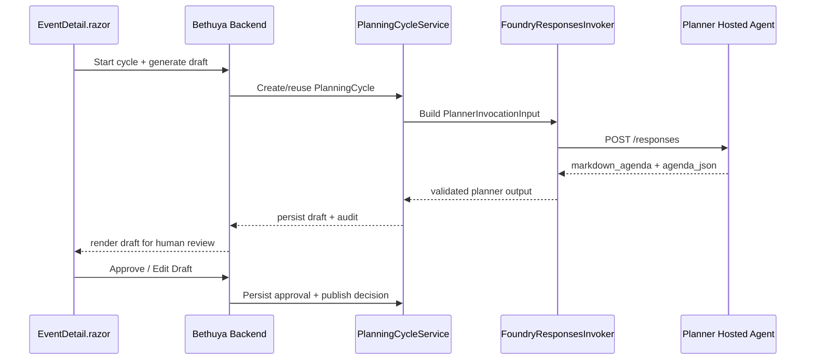

import { Image } from 'astro:assets';import AspireResourcesView from './aspire_resources_view.png';
import AgentBefore from './agent_before.png';
import AgentThinking from './agent_thinking.png';
import AgentOutput from './agent_output.png';
import BethuyaAspireLogs from './bethuya_aspire_logs.png';
import BethuyaAspireTraces from './bethuya_aspire_traces.png';

Most agent demos look impressive until you try to put them into production. Suddenly you’re dealing with containerization, auth, observability, versioning, and governance.


At HackerspaceMumbai, we wanted something different.

**Bethuya** is our  **agent-first**, **Aspire-orchestrated** platform for planning, curating, running, and reporting community events - built on a simple principle: 

> **AI drafts, humans approve, community owns**.  

It’s demo-ready today and designed to become the backbone of our event operations.

In this post, we’ll share how we’re evolving Bethuya into a **production-grade showcase** for the “new era” of agentic AI—starting by deploying the **Planner** as an **Azure AI Foundry Hosted Agent**, while keeping Bethuya as the **central orchestrator**.

---

## Why Hosted Agents (and not just calling a model)?

Once you move beyond prototypes, most of the work isn’t prompt engineering-it’s systems engineering.

* **Infrastructure** - containerization, service hosting, lifecycle management
* **Security & Identity** - token flow, isolation boundaries, secure access
* **State & Resilience** - scaling, persistence, rollout safety
* **Observability** - tracing across distributed execution

**[Foundry Hosted Agents](https://learn.microsoft.com/en-us/azure/foundry/agents/concepts/hosted-agents)** exist to solve these cross-cutting concerns as a managed runtime: you bring your agent code (C#/Python/your framework), package it as a container image, and the platform hosts it at scale with managed lifecycle, identity, and instrumentation.

---

## Aspire vs Hosted Agents: A clean separation of concerns

We are using both because they solve entirely different layers of the cloud-native agent stack:

### 🎛️ Aspire = the cockpit (composition + provisioning + local loop)

Aspire gives Bethuya a single “distributed app” definition: services, dependencies, wiring, and a consistent run/publish workflow.

### 🧠 Hosted Agents = the runtime (agent ops + lifecycle)
Hosted Agents turn an agent into a first-class deployable unit with its own endpoint, identity, scaling, sessions, and versioning.

Think:
- Aspire defines the system.
- Hosted Agents operate each agent “brain” like a product surface.


---

## Our architecture choice: Option A now, Option B later

### Option A (Now): Bethuya orchestrates agents
For now, Bethuya remains the **central orchestrator and system of record**:
- Bethuya calls Planner (and later Curator/Facilitator/Reporter)
- Bethuya stores audit trails, diffs, approvals, and published artifacts
- Planning never “auto-publishes” without explicit human action

This keeps governance crisp and debuggable.

### Option B (Later): agent delegation (A2A)
We are designing the interfaces and audit envelope so we can later enable **agent delegation** (agent-to-agent), while preserving Bethuya’s governance boundaries.

> The goal is to enable distributed intelligence without losing auditability.

---

## Planner-first: Why we’re starting here

Planner is the perfect first hosted agent because its contract is naturally “service-like”:
- it drafts agendas/timings/speaker suggestions
- and *never publishes* without human approval

This aligns perfectly to Bethuya’s governance model.

---

## The subtle production detail: Conversations ≠ Sessions

In Foundry Hosted Agents, **sessions** and **conversations** are different things:

- **Session** = stateful sandbox + persisted filesystem (`$HOME`, uploaded `/files`)
- **Conversation** = message/tool-call/response history that threads turns together

For the Responses protocol:
- multi-turn continuity comes from `previous_response_id` or a **conversation ID**
- reusing the same session ID alone does not recreate message history

This matters because it’s easy to build something that “looks stateful” (same session) but still “forgets” prior turns (no conversation threading).

---

## Our production strategy: Conversation per *Planning Cycle*

We deliberately chose **conversation-per-planning-cycle**, not “one conversation forever.”

Why? Because early on we expect:
- schema changes (especially our structured JSON output)
- prompt refinements
- refactors to orchestration boundaries

A “forever thread” mixes old assumptions with new behavior and makes debugging painful.

So we introduce a first-class domain object: `PlanningCycle`.

### Lifecycle

* **Open** → cycle starts, conversationId assigned
* **Lock** → publish seals the cycle
* **Revise** → new cycle, new conversation

### ⚙️ Execution Flow

* Bethuya creates/reuses a PlanningCycle
* Assigns a conversationId
* Builds request payload
* Calls Planner via `/responses`

This endpoint follows the **[OpenAI Responses API contract](https://platform.openai.com/docs/api-reference/responses)**, implemented by Foundry Hosted Agents:

* Agent returns structured output
* Bethuya validates, persists, and renders


```mermaid
sequenceDiagram
    participant UI as EventDetail.razor
    participant API as Bethuya Backend
    participant Cycle as PlanningCycleService
    participant Invoker as FoundryResponsesInvoker
    participant Agent as Planner Hosted Agent

    UI->>API: Start cycle + generate draft
    API->>Cycle: Create/reuse PlanningCycle
    Cycle->>Invoker: Build PlannerInvocationInput
    Invoker->>Agent: POST /responses
    Agent-->>Invoker: markdown_agenda + agenda_json
    Invoker-->>Cycle: validated planner output
    Cycle-->>API: persist draft + audit
    API-->>UI: render draft for human review
    UI->>API: Approve / Edit Draft
    API->>Cycle: Persist approval + publish decision
```

### Cycle close policy: Close on Publish to final schedule

A PlanningCycle stays active while drafting/reviewing/refining.
It closes only when we **Publish** the final schedule.

After publishing:
- the cycle is locked
- any changes create a **new** PlanningCycle with a **new** conversation ID

This gives us clean provenance:
- Cycle N produced the published schedule
- Cycle N+1 produced the next revision (hotfix or updated plan)

---

## Planner output: HYBRID by design (Human + Machine)

Planner returns a hybrid response:

1) **Markdown agenda** for human review and editing (diff-friendly)
2) **JSON sidecar** for structured workflows and future delegation

JSON is the source of truth; Markdown is the rendering.

### Minimum JSON fields (example)
- event metadata (title/date/timezone)
- agenda blocks (start/end/title/format)
- objectives, constraints
- rationale, risks, next actions

```json
{
  "AgendaVersion": "1.0",
  "Event": {
    "EventId": "019e63e8-f999-7978-88a0-33d97758df3c",
    "Title": "Build //Localhost : Mumbai",
    "Date": "2026-06-20",
    "Timezone": "Asia/Kolkata",
    "Location": "Microsoft Mumbai"
  },
  "Objectives": [
    "Maximize attendance fit with venue/locality constraints.",
    "Balance learning content with networking windows.",
    "Provide explicit ownership for next actions."
  ],
  "Constraints": [],
  "Agenda": {
    "TotalDurationMinutes": 195,
    "Blocks": [
      {
        "BlockId": "blk-01",
        "Start": "09:30",
        "End": "10:00"
      }
    ]
  }
}

```

This makes the UI great today and keeps us ready for deeper automation tomorrow.

---

## 🚀 Aspire + Foundry Integration

The biggest surprise building Bethuya:

> How easy it was to go from code to a running agent.

---

### 🧑‍💻 The setup experience

Once you’re authenticated (`az login`), the flow is almost frictionless.

Using [Aspire’s Azure AI Foundry integration](https://aspire.dev/integrations/cloud/azure/azure-ai-foundry), you can go from zero to a running Hosted Agent in minutes.

- You select or create:
  - an Azure subscription  
  - a resource group  
  - a Foundry project  

From there, Aspire handles the rest:
* resource provisioning
* environment wiring
* endpoint configuration

---

### 🏗️ What gets created

With minimal setup, Aspire provisions and connects:

- ✅ Azure Container Registry (ACR): Automated image builds and pushes for your agent container image.  
- ✅ Foundry Project + model deployment: Binds the backend LLMs (e.g., GPT-4o) directly to your project scope. 
- ✅ Hosted Agent runtime: Provisions the container app/agent host instance and exposes secure endpoints.
- ✅ Local + cloud configuration parity: Key-vault bindings and service connections are injected identically into both the local AppHost dashboard and the deployed cloud environment.  
- ✅ Identity and role bindings(RBAC): Automatically configures Managed Identities for token exchange between the host, ACR, and Foundry.

> Run locally-and Azure appears behind the scenes, ensuring local debugging and cloud deployment use the exact same topology.


<Image src={AspireResourcesView} alt="Aspire Resources View" />
---

### 🟢 Agent-aware UI

Aspire surfaces agents differently.

The “Send Message” icon [highlighted in green box] appears **only for agent endpoints (`/responses`)**.

* Send prompts directly
* Inspect responses
* Debug in isolation

> If you can message it, it’s an agent.

---

### 🧠 The Planner in Action: From Intent to Reasoned Output


The Planner shows:

* Initial state → idle
* Thinking → reasoning steps
* Output → structured timeline + explanation

<Image src={AgentBefore} alt="Agent Before" />

<Image src={AgentThinking} alt="Agent reasoning logs" />

<Image src={AgentOutput} alt="Agent Output" />


Each block includes:

* Type (Talk, Workshop, Break)
* Optimization tags
* Explicit reasoning (“why here”)

> The Planner doesn’t just generate a schedule-it shows its work.


## 🔎 Observing the Agent in Action

One of the strongest aspects of this setup is **observability**.

---

### 📜 Structured logs


* `POST /responses`
* Request → response cycle
* Status = 200

<Image src={BethuyaAspireLogs} alt="Structured Logs" />

---

### 🔁 Distributed traces

End-to-end:

UI → Backend → Agent → Response

* Agent appears as its own span
* Boundaries are explicit
* Timing is visible


<Image src={BethuyaAspireTraces} alt="Trace Timeline" />

---

### 🧩 Bringing it all together

* UI → entry point
* Logs → invocation
* Traces → orchestration  

> 💡 **By pairing Aspire’s orchestration with Azure AI Foundry’s Hosted Agent runtime, agents move from fragile prototypes to workloads that are fully observable, testable, and governable.**


---
## What “production-grade agentic” looks like (in practice)

### 1) 🚀 Planner ships independently
We can roll out Planner improvements without redeploying the entire Bethuya app.

### 2) 🧠 We version the agent “brain”
We record which agent version generated which schedule draft and which published schedule.

### 3) 📊 Observability is built-in
We can trace from Bethuya -> Planner -> model/tool calls, and we can correlate everything to a cycle/work item.

### 4) 🛡️ Governance stays human-first
AI drafts. Humans approve. Bethuya stores the audit record.

---

## Getting involved

- If you want to help implement Planner as a Hosted Agent, check out Bethuya:
  https://github.com/HackerspaceMumbai/bethuya

- If you want to contribute to this blog/site:
  https://github.com/HackerspaceMumbai/blog

Come build with us - PRs welcome !!!